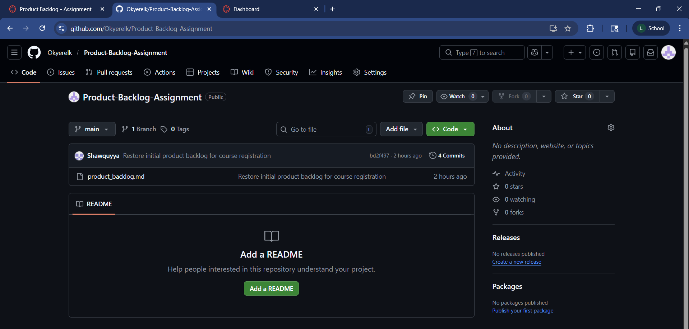

# Initial Product Backlog – VCU Summer 2026 Course Registration System

**Date:** March 5, 2026

## Key Stakeholders and Users
- **Students:** Find summer classes, check section details, register, and keep track of their schedule.
- **Instructors:** See which sections they’re teaching and who’s enrolled.
- **Registrar/Admin (authorized users):** Support registration, look up enrollments when issues come up, and make sure rules are followed.

The following product backlog represents the initial set of functional requirements for the VCU Summer 2026 Course Registration System. Each user story follows Scrum best practices and includes a priority based on stakeholder value and system dependencies.

## Product Backlog User Stories (Initial)

### User Story 1
**As a student, I want to search summer courses by department, instructor, or course number so that I can find the classes I’m interested in.**  
**Priority:** High  
**Priority justification:** This is one of the first things students need, and it supports everything else since students have to find a class before they can register.

### User Story 2
**As a student, I want to view section details (course number, section number, modality, instructor, and maximum seats) so that I can pick the best section before enrolling.**  
**Priority:** High  
**Priority justification:** Students need these details to make the right choice, and this is a direct dependency for enrolling.

### User Story 3
**As a student, I want to enroll in a section so that I can register for my summer classes.**  
**Priority:** High  
**Priority justification:** This is the main purpose of the system and provides the most value because it completes registration.

### User Story 4
**As a registrar administrator, I want the system to prevent students from registering for two sections of the same course so that registration rules are enforced.**  
**Priority:** Medium  
**Priority justification:** This keeps data accurate and prevents scheduling problems, but it comes after the basic enroll feature is working.

### User Story 5
**As a registrar administrator, I want the system to stop enrollment once a section reaches its seat limit so that sections do not exceed their maximum capacity.**  
**Priority:** Medium  
**Priority justification:** Seat limits are important for a realistic registration process and reduce manual fixes, but it depends on enrollment being in place.

### User Story 6
**As a student, I want to see the sections I’m enrolled in so that I can confirm my schedule and make sure everything looks correct.**  
**Priority:** Medium  
**Priority justification:** This improves the student experience and helps avoid confusion, but it relies on enrollments already being saved.

### User Story 7
**As an instructor, I want to view the sections I am teaching so that I can plan and prepare for the summer term.**  
**Priority:** Medium  
**Priority justification:** This supports instructor planning and is valuable, but it’s not as urgent as student registration features.

### User Story 8
**As an instructor, I want to view the roster for a section so that I know which students are enrolled and can plan communication.**  
**Priority:** Medium  
**Priority justification:** Rosters are important for instructors, and this feature depends on enrollment data already existing.

### User Story 9
As an authorized user, I want to look up a student’s enrolled sections to support advising and troubleshoot registration issues.**  
**Priority:** Medium  
**Priority justification:** This supports staff and advising, but it depends on enrollment information being stored in the system.

### User Story 10
**As a student, I want the option to drop a section so that I can update my schedule if something changes.**  
**Priority:** Low  
**Priority justification:** Dropping is useful, but it’s not required for the initial registration flow, so it can come after core features are stable.

### User Story 11
**As a student, I want to view prerequisite information for a course so that I can avoid registering for a class I’m not prepared for.**  
**Priority:** Low  
**Priority justification:** Prerequisite info helps students plan, but it is less time-sensitive than search and enrollment and can be added after the core system works.

## Team contributions statement (summary)
- **Leonard:** Organized the backlog into a clean final format, checked the user story wording (As a/I want/so that), and made sure priorities followed a bell curve.
- **Youssef:** Focused mainly on the student experience stories (search, view section details, view enrolled schedule) and helped tighten up wording so each story stayed clear and testable.
- **Javad:** Focused on the system rule stories (no duplicate course enrollment, seat limit enforcement) and helped justify priorities based on dependencies and correctness.
- **Saleh:** Focused on instructor/admin stories (teaching schedule, roster, student lookup) and helped make the final list consistent and easy to read.

## All team members worked together to create and review the initial product backlog. We split up the work so each person focused on a different part of the system, then we compared notes and finalized priorities as a group.

## Screenshot Proof (GitHub Backlog Posted)

